# Blockchain Project Step3

## 合约部署

本项目使用`Solidity`语言编写智能合约。

该项目包含一个合约，将项目涉及的三类对象，客户、商户、商品通过结构体进行了封装，并建立了一种映射，使得我们可以通过账户地址查找到客户与商户，通过商品ID查找到商品。

该项目使用**Ganache** (前身为TestRPC)作为以太坊客户端，使用**Truffle**作为开发框架，通过**Trufffle**工具将智能合约部署在私有链上。

合约部署情况如下：

- 开启`Ganache`图形化界面，并进行网络配置：

  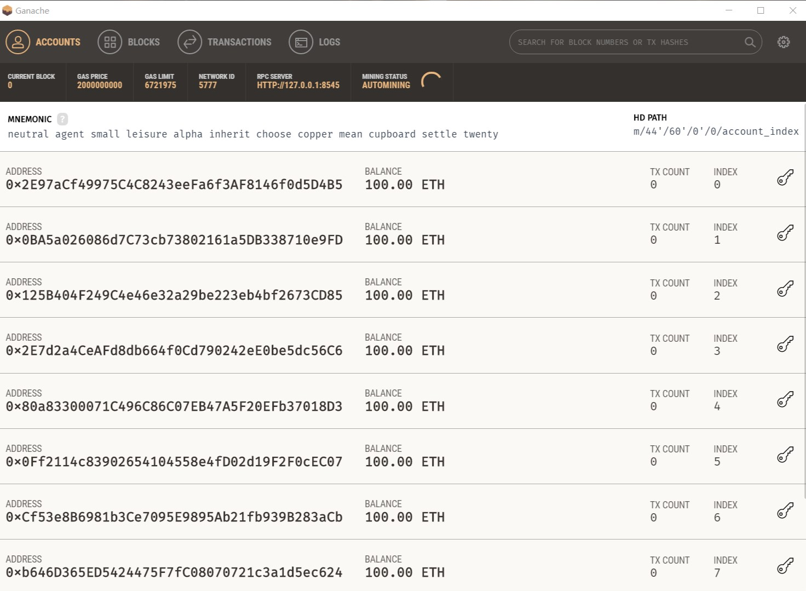

  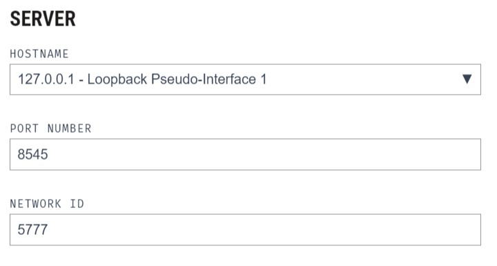

- 打开一个终端窗口，执行命令`truffle compile`，进行智能合约编译：

  

- `truffle migrate --network ganache`，智能合约部署：

  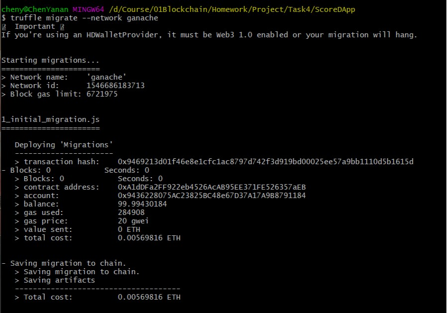

  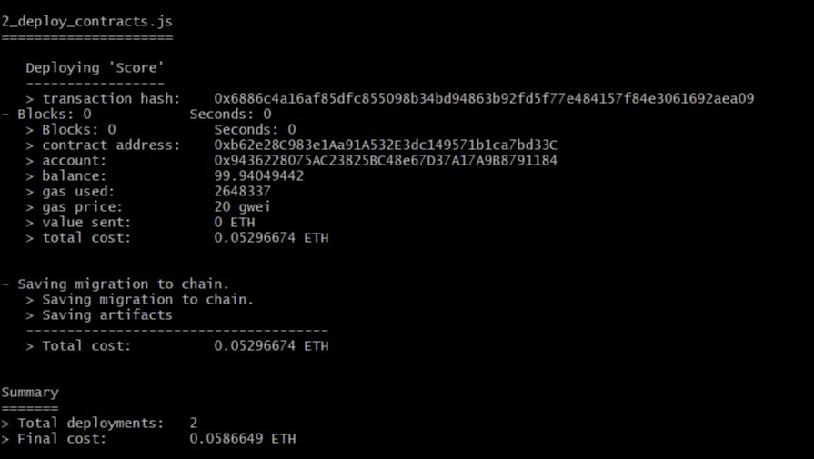

  此时，我们可以看到：

  产生交易，以太币减少：

  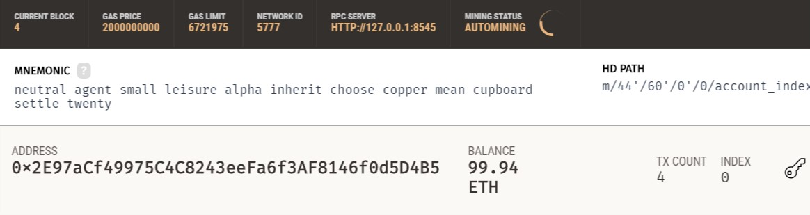

  交易信息：

  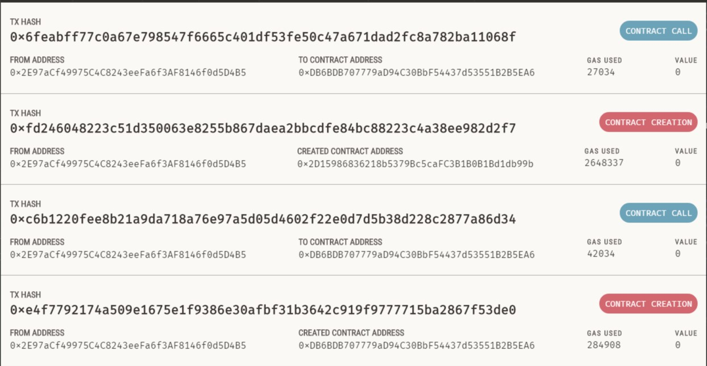

  交易产生区块信息：

  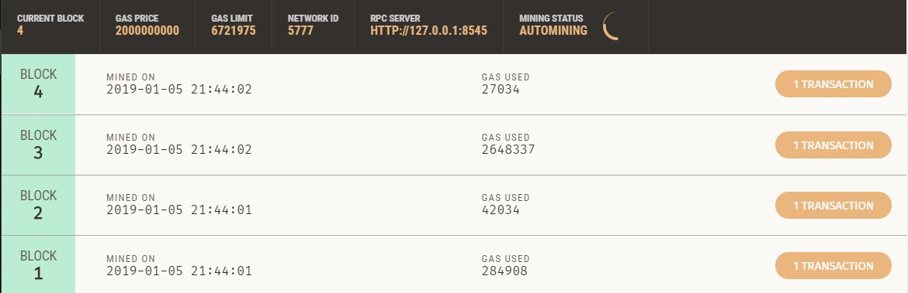

## 合约方法设计

该项目合约的方法设计主要针对每个功能模块中对外提供的方法进行设计，其实现分别如下：

- 客户/商户注册：

  ```
  //注册一个客户
  event NewCustomer(address sender, bool isSuccess, string password);
  function newCustomer(address _customerAddr, string memory _password) public {
      //判断是否已经注册
      if (!isCustomerAlreadyRegister(_customerAddr)) {
          //还未注册
          customer[_customerAddr].customerAddr = _customerAddr;
          customer[_customerAddr].password = stringToBytes32(_password);
          customers.push(_customerAddr);
          emit NewCustomer(msg.sender, true, _password);
          return;
      }
      else {
          emit NewCustomer(msg.sender, false, _password);
          return;
      }
  }
  
  //注册一个商户
  event NewMerchant(address sender, bool isSuccess, string message);
  function newMerchant(address _merchantAddr,string memory _password) public {
      //判断是否已经注册
      if (!isMerchantAlreadyRegister(_merchantAddr)) {
          //还未注册
          merchant[_merchantAddr].merchantAddr = _merchantAddr;
          merchant[_merchantAddr].password = stringToBytes32(_password);
          merchants.push(_merchantAddr);
          emit NewMerchant(msg.sender, true, "注册成功");
          return;
      }
      else {
          emit NewMerchant(msg.sender, false, "该账户已经注册");
          return;
      }
  }
  ```

- 判断客户/商户是否注册：

  ```
  //判断一个客户是否已经注册
  function isCustomerAlreadyRegister(address _customerAddr) internal view returns (bool)  {
      for (uint i = 0; i < customers.length; i++) {
          if (customers[i] == _customerAddr) {
         	 	return true;
          }
      }
      return false;
  }
  
  //判断一个商户是否已经注册
  function isMerchantAlreadyRegister(address _merchantAddr) public view returns (bool) {
      for (uint i = 0; i < merchants.length; i++) {
          if (merchants[i] == _merchantAddr) {
          	return true;
          }
      }
      return false;
  }
  ```

- 客户/商户登录：

  ```
  //查询用户密码
  function getCustomerPassword(address _customerAddr) view public returns (bool, bytes32) {
      //先判断该用户是否注册
      if (isCustomerAlreadyRegister(_customerAddr)) {
      	return (true, customer[_customerAddr].password);
      }
      else {
      	return (false, "");
      }
  }
  
  //查询商户密码
  function getMerchantPassword(address _merchantAddr) view public returns (bool, bytes32) {
      //先判断该商户是否注册
      if (isMerchantAlreadyRegister(_merchantAddr)) {
      	return (true, merchant[_merchantAddr].password);
      }
      else {
      	return (false, "");
      }
  }
  ```

- 银行发行积分：

  ```
  event SendScoreToCustomer(address sender, string message);
  
  function sendScoreToCustomer(address _receiver,
      uint _amount) onlyOwner public {
  
      if (isCustomerAlreadyRegister(_receiver)) {
          //已经注册
          issuedScoreAmount += _amount;
          customer[_receiver].scoreAmount += _amount;
          emit SendScoreToCustomer(msg.sender, "发行积分成功");
          return;
      }
      else {
          //还没注册
          emit SendScoreToCustomer(msg.sender, "该账户未注册，发行积分失败");
          return;
      }
  }
  ```

- 转让积分：

  ```
  event TransferScoreToAnother(address sender, string message);
  
  function transferScoreToAnother(uint _senderType,
      address _sender,
      address _receiver,
      uint _amount) public {
  
      if (!isCustomerAlreadyRegister(_receiver) && !isMerchantAlreadyRegister(_receiver)) {
          //目的账户不存在
          emit TransferScoreToAnother(msg.sender, "目的账户不存在，请确认后再转移！");
          return;
      }
      if (_senderType == 0) {
          //客户转移
          if (customer[_sender].scoreAmount >= _amount) {
              customer[_sender].scoreAmount -= _amount;
  
              if (isCustomerAlreadyRegister(_receiver)) {
                  //目的地址是客户
                  customer[_receiver].scoreAmount += _amount;
              } else {
                  merchant[_receiver].scoreAmount += _amount;
              }
              emit TransferScoreToAnother(msg.sender, "积分转让成功！");
              return;
          } else {
              emit TransferScoreToAnother(msg.sender, "你的积分余额不足，转让失败！");
              return;
          }
      } else {
          //商户转移
          if (merchant[_sender].scoreAmount >= _amount) {
              merchant[_sender].scoreAmount -= _amount;
              if (isCustomerAlreadyRegister(_receiver)) {
                  //目的地址是客户
                  customer[_receiver].scoreAmount += _amount;
              } else {
                  merchant[_receiver].scoreAmount += _amount;
              }
              emit TransferScoreToAnother(msg.sender, "积分转让成功！");
              return;
          } else {
              emit TransferScoreToAnother(msg.sender, "你的积分余额不足，转让失败！");
              return;
          }
      }
  }	
  ```

- 商户发布商品：

  ```
  event AddGood(address sender, bool isSuccess, string message);
  
  function addGood(address _merchantAddr, string memory _goodId, uint _price) public {
      bytes32 tempId = stringToBytes32(_goodId);
  
      //首先判断该商品Id是否已经存在
      if (!isGoodAlreadyAdd(tempId)) {
          good[tempId].goodId = tempId;
          good[tempId].price = _price;
          good[tempId].belong = _merchantAddr;
  
          goods.push(tempId);
          merchant[_merchantAddr].sellGoods.push(tempId);
          emit AddGood(msg.sender, true, "创建商品成功");
          return;
      }
      else {
          emit AddGood(msg.sender, false, "该件商品已经添加，请确认后操作");
          return;
      }
  }
  ```

- 客户购买商品：

  ```
  event BuyGood(address sender, bool isSuccess, string message);
  
  function buyGood(address _customerAddr, string memory _goodId) public {
      //首先判断输入的商品Id是否存在
      bytes32 tempId = stringToBytes32(_goodId);
      if (isGoodAlreadyAdd(tempId)) {
          //该件商品已经添加，可以购买
          if (customer[_customerAddr].scoreAmount < good[tempId].price) {
              emit BuyGood(msg.sender, false, "余额不足，购买商品失败");
              return;
          }
          else {
              //对这里的方法抽取
              customer[_customerAddr].scoreAmount -= good[tempId].price;
              merchant[good[tempId].belong].scoreAmount += good[tempId].price;
              customer[_customerAddr].buyGoods.push(tempId);
              emit BuyGood(msg.sender, true, "购买商品成功");
              return;
          }
      }
      else {
          //没有这个Id的商品
          emit BuyGood(msg.sender, false, "输入商品Id不存在，请确定后购买");
          return;
      }
  }
  ```

- 商户和银行清算积分：

  ```
  event SettleScoreWithBank(address sender, string message);
  
  function settleScoreWithBank(address _merchantAddr, uint _amount) public {
      if (merchant[_merchantAddr].scoreAmount >= _amount) {
          merchant[_merchantAddr].scoreAmount -= _amount;
          settledScoreAmount += _amount;
          emit SettleScoreWithBank(msg.sender, "积分清算成功");
          return;
      }
      else {
          emit SettleScoreWithBank(msg.sender, "您的积分余额不足，清算失败");
          return;
      }
  }
  ```

## 接口设计

**Truffle**内部已经默认集成了`web3.js`接口，所以我们使用`web3.js`接口实现与合约方法对接，需要完成的接口如下（部分）：

- 连接以太坊：

  ```javascript
  // 获得合约实例
  init: function () {
    // 设置web3连接
    ScoreContract.setProvider(window.web3.currentProvider)
    // Get the initial account balance so it can be displayed.
    window.web3.eth.getAccounts(function (err, accs) {
      if (err != null) {
        window.App.setStatus('There was an error fetching your accounts.')
        return
      }
  
      if (accs.length === 0) {
        window.App.setStatus('Couldn\'t get any accounts! Make sure your Ethereum client is configured correctly.')
        return
      }
      accounts = accs
      account = accounts[0]
    })
  
    ScoreContract.deployed().then(function (instance) {
      ScoreInstance = instance
    }).catch(function (e) {
      console.log(e, null)
    })
  }
  ```

- 客户/商户注册：

  ```javascript
  // 注册客户
  newCustomer: function (ScoreInstance, account) {
    const address = document.getElementById('customerAddress').value
    const password = document.getElementById('customerPassword').value
    console.log(address + ' ' + password)
    ScoreInstance.newCustomer(address, password, { from: account, gas: 3000000 }).then(function () {
      ScoreInstance.NewCustomer(function (e, r) {
        if (!e) {
          console.log(r)
          console.log(r.args)
          if (r.args.isSuccess === true) {
            window.App.setStatus('注册成功')
          } else {
            window.App.setStatus('账户已经注册')
          }
        } else {
          console.log(e)
        }
      })
    })
  }
  // 注册商家
  newMerchant: function (ScoreInstance, account) {
    const address = document.getElementById('merchantAddress').value
    const password = document.getElementById('merchantPassword').value
    ScoreInstance.newMerchant(address, password, { from: account, gas: 1000000 }).then(function () {
      ScoreInstance.NewMerchant(function (error, event) {
        if (!error) {
          console.log(event.args.message)
          window.App.setStatus(event.args.message)
        }
      })
    })
  }
  ```

- 客户/商户登录：

  ```javascript
  // 客户登录
  customerLogin: function (ScoreInstance, account) {
    const address = document.getElementById('customerLoginAddr').value
    const password = document.getElementById('customerLoginPwd').value
    ScoreInstance.getCustomerPassword(address, { from: account, gas: 3000000 }).then(function (result) {
      if (result[0]) {
        // 查询密码成功
        if (password.localeCompare(utils.hexCharCodeToStr(result[1])) === 0) {
          console.log('登录成功')
          // 跳转到用户界面
          window.location.href = 'customer.html?account=' + address
        } else {
          console.log('密码错误，登录失败')
          window.App.setStatus('密码错误，登录失败')
        }
      } else {
        // 查询密码失败
        console.log('该用户不存在，请确定账号后再登录！')
        window.App.setStatus('该用户不存在，请确定账号后再登录！')
      }
    })
  }
  // 商家登录
  merchantLogin: function (ScoreInstance, account) {
    const address = document.getElementById('merchantLoginAddr').value
    const password = document.getElementById('merchantLoginPwd').value
    ScoreInstance.getMerchantPassword(address, { from: account }).then(function (result) {
      console.log(password)
      console.log(utils.hexCharCodeToStr(result[1]))
      if (result[0]) {
        // 查询密码成功
        if (password.localeCompare(utils.hexCharCodeToStr(result[1])) === 0) {
          console.log('登录成功')
          // 跳转到商户界面
          window.location.href = 'merchant.html?account=' + address
        } else {
          console.log('密码错误,登录失败')
          window.App.setStatus('密码错误，登录失败')
        }
      } else {
        // 查询密码失败
        console.log('该商户不存在，请确定账号后再登录！')
        window.App.setStatus('该商户不存在，请确定账号后再登录！')
      }
    })
  }
  ```

- 银行发行积分：

  ```javascript
  sendScoreToCustomer: function (ScoreInstance, account) {
    const address = document.getElementById('customerAddress').value
    const score = document.getElementById('scoreAmount').value
    ScoreInstance.sendScoreToCustomer(address, score, { from: account })
    ScoreInstance.SendScoreToCustomer(function (e, r) {
      if (!e) {
        console.log(r.args.message)
        window.App.setStatus(r.args.message)
      }
    })
  }
  ```

- 转让积分：

  ```javascript
  transferScoreToAnotherFromCustomer: function (currentAccount, ScoreInstance, account) {
    const receivedAddr = document.getElementById('anotherAddress').value
    const amount = parseInt(document.getElementById('scoreAmount').value)
    ScoreInstance.transferScoreToAnother(0, currentAccount, receivedAddr, amount, { from: account })
    ScoreInstance.TransferScoreToAnother(function (e, r) {
      if (!e) {
        console.log(r.args)
        window.App.setStatus(r.args.message)
      }
    })
  }
  ```

- 商户发布商品：

  ```javascript
  addGood: function (currentAccount, ScoreInstance, account) {
    const goodId = document.getElementById('goodId').value
    const goodPrice = parseInt(document.getElementById('goodPrice').value)
    ScoreInstance.addGood(currentAccount, goodId, goodPrice, { from: account, gas: 2000000 }).then(function () {
      ScoreInstance.AddGood(function (error, event) {
        if (!error) {
          console.log(event.args.message)
          window.App.setStatus(event.args.message)
        }
      })
    })
  }
  ```

- 客户购买商品：

  ```javascript
  // 购买物品
  buyGood: function (currentAccount, ScoreInstance, account) {
    const goodId = document.getElementById('goodId').value
    ScoreInstance.buyGood(currentAccount, goodId, { from: account, gas: 1000000 }).then(function () {
      ScoreInstance.BuyGood(function (error, event) {
        if (!error) {
          console.log(event.args.message)
          window.App.setStatus(event.args.message)
        }
      })
    })
  }
  ```

## 合约调用

下面我们测试合约中的部分方法，检验合约的调用情况：

- 合约部署，连接以太坊：

  

  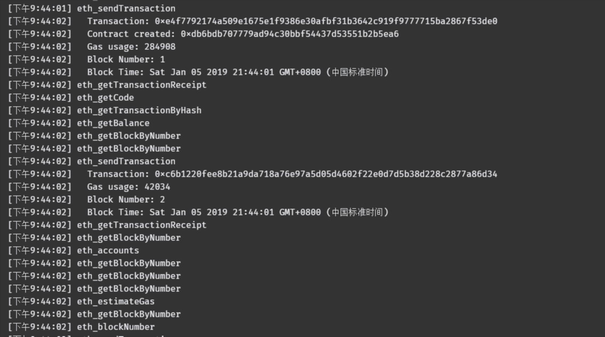

  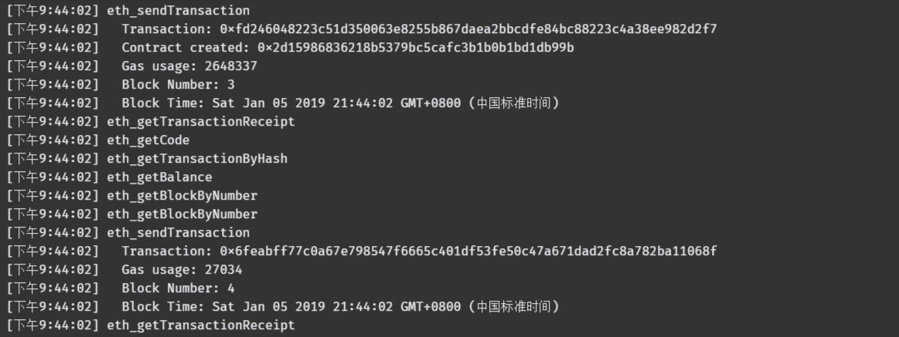

- 客户注册并登录：

  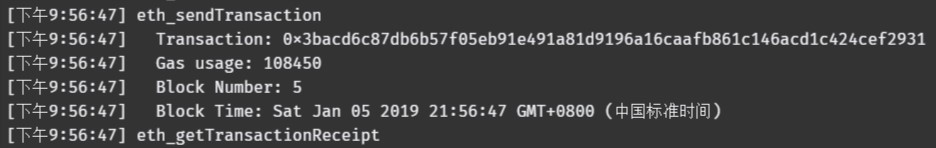

  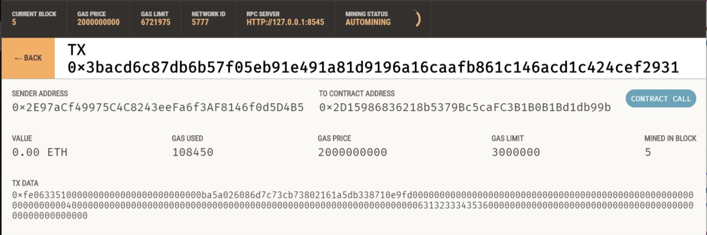

- 商户注册并登录：

  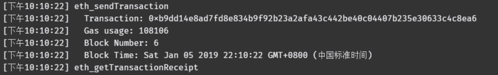

  

- 商户发布商品：

  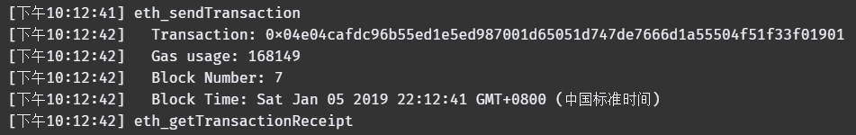

  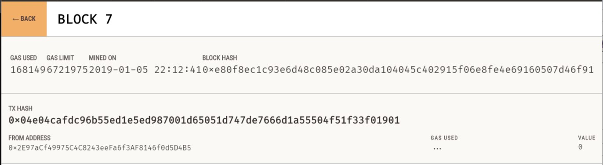

