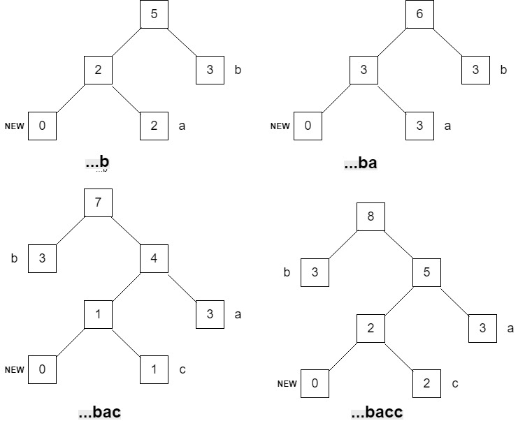

# Digital Media Hw 2

## Q1:

(a) What are the advantages of Adaptive Huffman Coding compared to the original Huffman Coding algorithm?

(b) Assume that the Adaptive Huffman Coding is used to code an information source S with a vocabulary of four letters (a, b, c, d). Before any transmission, the initial coding is a = 00, b = 01, c = 10, d = 11. As in the example illustrated in Fig. 7.8, a special symbol NEW will be sent before any letter if it is to be sent the first time.
Fig. 7.18 is the Adaptive Huffman Tree after sending letters **aabb**.

After that, the additional bitstream received by the decoder for the next few letters is 01010010101.

​	(i) What are the additional letters received?

​	(ii) Draw the adaptive Huffman trees after each of the additional letters is received.

## Answer:

(a)

- 自适应哈夫曼编码更具有动态性，这种方法中，统计数字是随着数据流的到达而动态的收集和更新的，概率不再是基于先验知识而是基于到目前为止实际收到的数据；
- 由于在文件头中不需要保存编码树，自适应哈夫曼编码也节省了开销。

(b)

(i) The additional letters received are **bacc**;

-  解码器接受到的编码位流前两位为01，在图中可找到编码 01 为 b，将 b 加入，触发交换过程，a 的编码会变为01，b 的编码会变为10；
- 接下来接收到字母编码为 01，字母为 a，将 a 加入；
- 接下来接收到字母编码为 00，由其后两位编码为 10 可知此字母为 c，将 c 加入；
- 最后是三位编码，通过最新生成的哈夫曼树得出为 c ;

详细过程见下图；

(ii)

## Q2:

You are given a computer cartoon picture and a photograph. If you have a choice of using either JPEG compression or GIF, which compression would you apply for these two images? Justify your answer.

## Answer:

#### 理论原因：

卡通图片使用`GIF`图像压缩方法，照片用`JPEG`图像压缩方法：

- `GIF`通过减少颜色通道的方法压缩图片，使得颜色通道从24位变为8位，适用于卡通图像这类具有少量独特色彩的图像，并且`GIF`支持隔行扫描，可以通过套色显示方法处理，相隔的像素可以连续显示，让图像总体轮廓迅速显示，进而显示细节；
- `JPEG`使用24 位颜色通道存储图像，适用于照片这类颜色丰富的图像，而且`JPEG`的压缩通过游长编码后能够使得连续的`0bit`被一个数对表示，同时其所使用的标准的`DC`, 、`AC`和`Huffman`也使得编码被压缩。

#### 程序实现：

采用`OpenCV`实现的`JPEG`压缩算法，包括`DCT`、量化、`IDCT`、熵编码、哈夫曼编码，代码详见`Code`文件夹；

#### 结果对比：

|    比较参数    | 卡通图片 | 动物照片 |
| :------------: | :------: | :------: |
|    原始大小    | 17160000 | 16760832 |
| JPEG压缩后大小 |    -     |    -     |
|   JPEG压缩率   |    -     |    -     |
| GIF压缩后大小  | 5720000  | 5586944  |
|   GIF压缩率    |  33.33%  |  33.33%  |

动物图片：

  

卡通图片：

  

> 自左向右依次为：卡通图片原图、JPEG压缩图、GIF压缩图

综合对比以上图片，我们可以得到：

- 三类图片视觉效果无太大差异，不过动物图片中`JPEG`压缩图的色彩饱和度略低于其他两幅图像，卡通图片中`GIF`压缩图的色彩饱和度略高于其他两幅图像；
- `JPEG`压缩图压缩率较高；
- 图片进行放大后，`JPEG`压缩图失真度高于`GIF`压缩图。